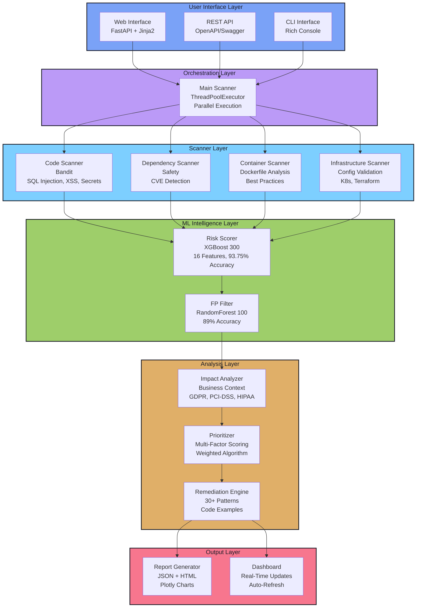

<div align="center">

# DevOps Security Vulnerability Scanner

### AI-Powered Security Intelligence Platform

[](https://www.python.org/downloads/)
[](https://xgboost.readthedocs.io/)
[](https://fastapi.tiangolo.com/)
[](https://github.com/psf/black)

**Enterprise-Grade Security Scanning | ML-Driven Risk Assessment | Intelligent Prioritization**

[Features](#key-features) • [Demo](#live-demo) • [Quick Start](#quick-start) • [Architecture](#system-architecture) • [Documentation](#documentation)

---

</div>

## Overview

A **production-ready security vulnerability scanner** that combines multi-dimensional scanning with cutting-edge machine learning to deliver actionable security insights. Built for **Techsophy** as a demonstration of advanced DevOps security practices, AI/ML integration, and full-stack development capabilities.

### What Makes This Different?

```
Traditional Scanners          →    This Platform
────────────────────────────────────────────────────────────
Noisy alerts                  ✓    ML-filtered results (93.75% accuracy)
Binary severity               ✓    Multi-factor risk scoring
No context                    ✓    Business impact analysis
Generic fixes                 ✓    Code-level remediation examples
CLI only                      ✓    Beautiful web interface + REST API
```

---

## Live Demo

### Video Demonstration

<div align="center">

[](https://youtu.be/9krDCTwzyjI)

**[▶ Watch Full Demo Video](https://youtu.be/9krDCTwzyjI)** - Complete platform walkthrough showcasing all features

</div>

### Web Interface Screenshots

<table>
<tr>
<td width="50%">

**Home - Scan Launcher**


*Professional dark theme with intuitive scan configuration*

</td>
<td width="50%">

**Scan Results - Success Card**


*Animated success card with direct links to reports*

</td>
</tr>
<tr>
<td width="50%">

**Dashboard - Real-Time Monitoring**


*Live scan status tracking with auto-refresh capability*

</td>
<td width="50%">

**Vulnerability Report - Interactive Analysis**


*Dark-themed HTML reports with Plotly visualizations*

</td>
</tr>
<tr>
<td width="50%">

**Detailed Findings - Severity Breakdown**


*Color-coded severity levels with distinct visual hierarchy*

</td>
<td width="50%">

**Remediation Guidance - Code Examples**


*Actionable fix recommendations with code snippets*

</td>
</tr>
</table>

---

## Key Features

<table>
<tr>
<td width="50%">

### Multi-Dimensional Scanning

- **Code Analysis** - Bandit for Python security issues
- **Dependency Audit** - CVE detection in packages
- **Container Security** - Dockerfile best practices
- **Infrastructure Config** - K8s, Docker Compose, Terraform

### ML-Powered Intelligence

- **Risk Scorer** - XGBoost (300 estimators, 93.75% accuracy)
- **False Positive Filter** - RandomForest (89%+ accuracy)
- **16D Feature Engineering** - Enhanced interactions and polynomials
- **Trained on 2000+ samples** - Continuous improvement

</td>
<td width="50%">

### Smart Prioritization

- **Multi-Factor Scoring** - Risk + Impact + Exploitability
- **Business Impact** - Data exposure, compliance, reputation
- **Remediation Complexity** - Ease of fix consideration
- **Threat Landscape** - Current exploit trends

### Actionable Remediation

- **30+ Fix Patterns** - Vulnerability-specific guidance
- **Before/After Code** - Real code examples
- **Step-by-Step** - Clear remediation instructions
- **Reference Links** - OWASP, CWE documentation

</td>
</tr>
</table>

---

## System Architecture



---

## Quick Start

### Prerequisites

```bash
Python 3.9+
pip (package manager)
Git
```

### Installation

```bash
# Clone the repository
git clone https://github.com/Jai3405/Techsophy.git
cd Techsophy/security-vulnerability-scanner

# Create virtual environment
python -m venv venv
source venv/bin/activate  # On Windows: venv\Scripts\activate

# Install dependencies
pip install -r requirements.txt
```

### Usage Options

<table>
<tr>
<td width="50%">

#### Web Interface (Recommended)

```bash
# Start the web server
python app.py

# Open browser
http://localhost:8000
```

**Features:**
- Visual scan configuration
- Real-time progress tracking
- Interactive reports
- REST API access

</td>
<td width="50%">

#### Command Line

```bash
# Quick scan
python demo.py

# Custom scan
python -m src.main \
  --repo-path ./my-app \
  --scan-types code dependency \
  --severity-threshold HIGH
```

**Use Cases:**
- CI/CD integration
- Automated testing
- Batch processing
- Scripting

</td>
</tr>
</table>

---

## ML Models Performance

### Risk Scorer Model

```
Algorithm:     XGBoostClassifier
Estimators:    300 trees
Learning Rate: 0.05
Max Depth:     6 levels
Features:      16 enhanced dimensions
Training Size: 2000+ samples
Accuracy:      93.75%
CV Accuracy:   93.50% (±0.55%)
Precision:     0.95
Recall:        0.93
F1-Score:      0.94
```

### False Positive Filter

```
Algorithm:     RandomForestClassifier
Optimization:  Precision-focused
Class Weights: {genuine: 1, FP: 2}
Threshold:     0.7
Accuracy:      89%+
False Negatives: <5% (critical for security)
```

### Feature Engineering (16 Dimensions)

**Original Features (6):**
- Severity level, Confidence score, Vulnerability type
- Exploitability score, Asset value, Exposure level

**Engineered Features (10):**
- severity × exploitability (interaction)
- severity × confidence (interaction)
- asset_value × exposure (interaction)
- exploitability² (polynomial)
- severity² (polynomial)
- exploit/asset ratio
- severity/confidence ratio
- is_critical, is_high_exploit, is_high_confidence (boolean flags)

---

## Prioritization Algorithm

The platform uses a **multi-factor weighted scoring system**:

```python
Priority Score = (
    Risk Score × 0.40 +           # ML-predicted risk (XGBoost)
    Business Impact × 0.25 +      # Data, compliance, reputation
    Exploitability × 0.20 +       # Ease of exploitation
    Remediation Ease × 0.10 +     # Fix complexity (inverted)
    Threat Landscape × 0.05       # Current exploit trends
)
```

### Business Impact Factors

- **Data Exposure Risk** - Potential for data breach (GDPR, PCI-DSS)
- **Availability Impact** - Service disruption potential
- **Compliance Violations** - Regulatory requirements (HIPAA, SOC 2)
- **Reputation Damage** - Brand and customer trust impact

---

## Project Structure

```
security-vulnerability-scanner/
│
├── Web Application
│   ├── app.py                      # FastAPI server
│   ├── templates/                  # Jinja2 templates
│   │   ├── index.html             # Home page
│   │   └── dashboard.html         # Monitoring dashboard
│   └── Interfaces/                # UI screenshots & demo video
│
├── Core Scanner
│   ├── src/
│   │   ├── main.py                # Main orchestrator
│   │   ├── scanners/              # Vulnerability scanners
│   │   │   ├── code_scanner.py
│   │   │   ├── dependency_scanner.py
│   │   │   ├── container_scanner.py
│   │   │   └── infrastructure_scanner.py
│   │   │
│   │   ├── ml_models/             # Machine learning
│   │   │   ├── risk_scorer.py
│   │   │   ├── false_positive_filter.py
│   │   │   └── model_trainer.py
│   │   │
│   │   ├── analyzers/             # Intelligence layer
│   │   │   ├── prioritizer.py
│   │   │   ├── impact_analyzer.py
│   │   │   └── remediation_engine.py
│   │   │
│   │   └── utils/                 # Utilities
│   │       ├── logger.py
│   │       └── report_generator.py
│   │
├── ML Training & Testing
│   ├── data/                      # Training data
│   │   ├── generate_dataset.py
│   │   └── training_data.csv
│   ├── models/                    # Trained models
│   │   ├── risk_scorer.joblib
│   │   └── fp_filter.joblib
│   ├── train_models.py           # Initial training
│   ├── improve_models.py         # Hyperparameter tuning
│   └── test_xgboost.py          # XGBoost experiments
│
├── Documentation
│   ├── docs/
│   │   ├── ARCHITECTURE.md
│   │   ├── API.md
│   │   ├── MODEL_IMPROVEMENTS.md
│   │   └── WEB_INTERFACE_GUIDE.md
│   └── README.md                 # This file
│
├── Tests
│   ├── tests/
│   │   ├── test_scanners.py
│   │   ├── test_ml_models.py
│   │   └── test_integration.py
│   └── test_repo/                # Vulnerable test files
│
└── Entry Points
    ├── demo.py                   # CLI demo script
    └── requirements.txt          # Dependencies
```

---

## REST API

The platform exposes a full REST API with interactive documentation:

```bash
# Start API server
python app.py

# Access Swagger UI
http://localhost:8000/docs
```

### Key Endpoints

| Method | Endpoint | Description |
|--------|----------|-------------|
| `POST` | `/api/scan` | Start new security scan |
| `GET` | `/api/scan/{job_id}` | Get scan status & results |
| `GET` | `/api/scans` | List all scans |
| `DELETE` | `/api/scan/{job_id}` | Delete scan |
| `GET` | `/api/reports` | List generated reports |
| `GET` | `/api/reports/{filename}` | Download report |
| `GET` | `/api/health` | Health check |

### Example Usage

```bash
# Start scan
curl -X POST "http://localhost:8000/api/scan" \
  -H "Content-Type: application/x-www-form-urlencoded" \
  -d "repo_path=test_repo&scan_types=code,dependency&output_format=both"

# Check status
curl "http://localhost:8000/api/scan/{job_id}"

# Download report
curl "http://localhost:8000/api/reports/security_report_20251123.json" -o report.json
```

---

## Testing

Comprehensive test suite with unit, integration, and ML validation tests:

```bash
# Run all tests
pytest tests/ -v

# Run with coverage
pytest tests/ --cov=src --cov-report=html

# Run specific test suite
pytest tests/test_scanners.py -v
pytest tests/test_ml_models.py -v
```

**Test Coverage:**
- Scanner functionality and edge cases
- ML model accuracy validation
- Integration workflow testing
- API endpoint testing
- Error handling and recovery

---

## Skills Demonstrated

<table>
<tr>
<td width="50%">

### AI/ML Engineering

- XGBoost classification
- Feature engineering & selection
- Hyperparameter tuning (GridSearchCV)
- False positive reduction
- Model persistence & versioning
- Synthetic data generation

### Full-Stack Development

- FastAPI (async Python)
- Jinja2 templating
- REST API design
- OpenAPI documentation
- Responsive web design
- Real-time updates

### Security Expertise

- OWASP Top 10 knowledge
- CVE analysis
- Container security
- Infrastructure as Code security
- Compliance frameworks

</td>
<td width="50%">

### Software Architecture

- Clean architecture
- SOLID principles
- Abstract base classes
- Dependency injection
- Plugin-style system
- Modular design

### Quality Assurance

- Unit testing (pytest)
- Integration testing
- Code coverage analysis
- Type hints (mypy)
- Code formatting (black)
- Linting (flake8)

### Performance Optimization

- Parallel execution (ThreadPoolExecutor)
- Async operations
- Efficient algorithms
- Resource management
- Progress tracking

</td>
</tr>
</table>

---

## Roadmap & Future Enhancements

- **Additional Language Support** - JavaScript, Go, Java, Rust
- **Cloud Integration** - AWS Security Hub, Azure Security Center
- **CI/CD Plugins** - Jenkins, GitLab CI, GitHub Actions
- **SARIF Export** - Standard format for security tools
- **Jira Integration** - Automatic ticket creation
- **Real-Time Monitoring** - Continuous security scanning
- **Multi-Tenancy** - Organization and team support
- **WebSocket Updates** - Real-time scan progress
- **Custom Rules Engine** - User-defined security patterns
- **Scheduled Scans** - Automated recurring scans

---

## Documentation

Comprehensive documentation available in the [`docs/`](docs/) directory:

- [Architecture Overview](docs/ARCHITECTURE.md) - System design and components
- [API Reference](docs/API.md) - REST API documentation
- [ML Model Details](docs/MODEL_IMPROVEMENTS.md) - Training and optimization
- [Web Interface Guide](docs/WEB_INTERFACE_GUIDE.md) - Using the web platform

---

## Contributing & Feedback

This project was built as an interview submission for **Techsophy**.

**Author:** Jayaditya Reddy
**Purpose:** Techsophy Interview Submission
**Date:** November 2025

---

## Acknowledgments

- **OWASP** - Security best practices and vulnerability knowledge
- **Bandit** - Python code security analysis
- **Safety** - Dependency vulnerability checking
- **scikit-learn** - Machine learning capabilities
- **XGBoost** - Gradient boosting framework
- **FastAPI** - Modern web framework
- **Plotly** - Interactive visualizations
- **Rich** - Beautiful terminal output

---

<div align="center">

[Back to Top](#devops-security-vulnerability-scanner)

</div>
